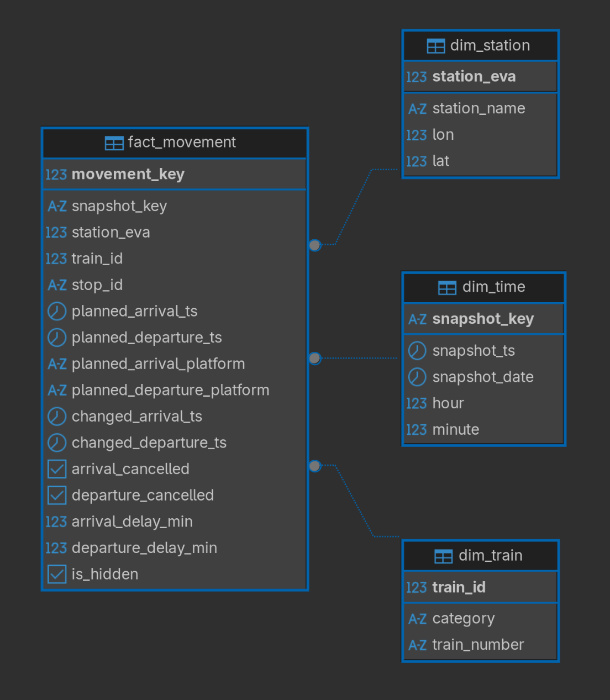

# Pipeline

## Initial Setup

Extract the content you unzip from the folders `/DBahn-berlin/timetable` and `/DBahn-berlin/timetable_changes` respectively into folders named `/timetable` and `/timetable_changes`. So the folder structure looks like the following:

```
.
├── DBahn-berlin
│   ├── ...
│   ├── timetable_changes
│   └── timetables
├── ...
├── timetable_changes
└── timetables
```

The folders `/timetable` and `/timetable_changes` will be gitignored.

## The Data

You start from three separate raw components (Stations `.json`, Timetables `.xml`, Timetable Changes `.xml`) and design your own star schema that can represent all of them once ingested.

### Station:

Must-haves:

- `name`: station name
- `evaNumbers`: to tie with the `XML` files. (`XML` should be using `evaNumbers.number`)
    - Use EVA numbers for `XML` joins.

Nice-to-haves:

- `number`: DB station record id, but the XML is EVA-based, so not our primary join key.
- `ifopt`: useful as an additional stable identifier and for debugging

This is what we would have with the two must-have params:

```json
{
      "name": "Ahrensfelde",
      "evaNumbers": [
        {
          "number": 8011003,
          "geographicCoordinates": {
            "type": "Point",
            "coordinates": [
              13.565154,
              52.571375
            ]
          },
          "isMain": true
        },
        {
          "number": 8089188,
          "geographicCoordinates": {
            "type": "Point",
            "coordinates": [
              13.565551,
              52.5712445
            ]
          },
          "isMain": false
        }
      ],
}
```

> [!IMPORTANT]
> `"isMain": true` means this is the primary one among several identifiers for the same station record. Only consider entries with `true`.

### Timetable

Folder structure:

```
.
└── timetables
    └── week
	    └── hour
		    └── station_timetable

```

Example `berlin_ostbahnhof_timetable.xml` from path `/timetables/250902_250909/2509021400` (On day 02.09.25 at 14:00):

How to read an `<s>` block like a timetable entry:

The root:

```xml
<timetable station="Berlin Ostbahnhof">
```

Each `<s>` is one stop (one train calling at this station).
Example:

```xml
<s id="5871316147024433626-2509021411-3">
  <tl f="N" t="p" o="800165" c="RB" n="56935" />
  <ar pt="2509021420" pp="1" l="23" ppth="Berlin Friedrichstraße|Berlin Alexanderplatz" />
  <dp pt="2509021421" pp="1" l="23" ppth="Berlin Ostkreuz|Flughafen BER" />
</s>
```

- Stop ID: `5871316147024433626-2509021411-3`
	- Unique identifier for "this trip at this station (and this stop index)"
- Train label: `<tl .../>`
	- `f="N"`: flags (can be ignored)
	- `t="p"`: trip type (here _planned_)
	- `o="800165"` operator/owner code
	- `c="RB"`: category (here _RB_)
	- `n="56935"`: train number
	- So train **RB 56935**
- Arrival event `<ar .../>`
	- `pt="2509021420"`: planned arrival time = `2025-09-02 14:20`
	- `pp="1"`: planned platform = `1`
	- `l="23"`: line indicator (often relevant for S/RB)
	- `ppth="Berlin Friedrichstraße|Berlin Alexanderplatz"`
		- Stations before the current station, so it came from `Friedrichstrasse -> Alexanderplatz -> Ostbahnhof`
- Departure event `<dp .../>`
	- `pt="2509021421"`: planned departure time = `2025-09-02 14:21`
	- `pp="1"`: planned platform
	- `l="23"`: line indicator
	- `ppth="Berlin Ostkreuz|Flughafen BER"`
		- Stations after the current station, so it goes `Ostbahnhof -> Ostkreuz -> Flughafen BER`

**Safe to ignore:**
- `tl @f` (flags)
- `tl @t` (trip type)
- `tl @o` (operator/owner)
- `ar/dp @l` (line indicator)
- `ar/dp @ppth` (path string)
	- For the last tasks (graph) we'll need "connections/edges", but we can derive edges from other sources (e.g. stop sequences via trip IDs)

**Keep:**

- `s @id` (stop ID)
    - Best stable key to de-duplicate and join planned vs changes for same stop/event
- `tl @c` (category) and `tl @n` (train number)
	- Concatenate them to get the train name.
	- These could be ignored and the delays/cancellations could still be computed. But they are tiny and useful for debugging ("which train is this?"), so keep.
- `ar/dp @pt` (planned time)
	- Must have: Needed for delay computations (changed - planned)
- `ar/dp @pp` (planned platform)
	- Not required for core tasks, but cheap to keep and helps sanity-checking.


### Timetable Change

Folder structure:

```
.
└── timetables_changes
    └── week
	    └── 15_mins
		    └── station_change
```

Example `berlin_hauptbahnhof_change.xml` from path `/timetable_changes/250902_250909/2509021600` (On day 02.09.25 at 16:00):

The root:

```xml
<timetable station="Berlin Hbf" eva="8011160">
```

Each `<s>` is one stop (one train calling at this station).
Example:

```xml
<s id="-4020550040361167307-2509021345-8" eva="8011160">
    <m id="r2415041" t="h" from="2505120800" to="2509202359" cat="Information" ts="2505112304" ts-tts="25-09-02 10:48:50.464" pr="3" />
    <ar ct="2509021817">
      <m id="r23682215" t="d" c="43" ts="2509021516" ts-tts="25-09-02 15:16:53.743" />
    </ar>
    <dp ct="2509021821">
      <m id="r23682215" t="d" c="43" ts="2509021516" ts-tts="25-09-02 15:16:53.743" />
    </dp>
</s>
```

- Label `<s .../>`
	- Stop ID: `"5871316147024433626-2509021411-3"`
		- This is your best key to match the change record to the corresponding planned stop (so you can compare `ct` vs `pt`).
	- EVA: `"8011160"`
		- station join key back to `dim_station` and the planned timetable.
- Label `<m .../>`
	- `id="r2415041"`
	- `t="h"`
	- `from="2505120800"`
	- `to="2509202359"`
	- `cat="Information"`
	- `ts="2505112304"`
	- `ts-tts="25-09-02 10:48:50.464"`
	- `pr="3"`
- Arrival event `<ar .../>`
	- `ct="2509021817"`: changed time
	- Label `<m .../>`
		- `id="r23682215"`
		- `t="d"`
		- `c="43"`
		- `ts="2509021516"`
		- `ts-tts="25-09-02 15:16:53.743"`
			- ignore and rely on the compact `ts` or the snapshot folder time
- Departure event `<dp .../>`
	- `ct="2509021821"`: changed time
	- Label `<m .../>`
		- `id="r23682215"`
		- `t="d"`
		- `c="43"`
		- `ts="2509021516"`
		- `ts-tts="25-09-02 15:16:53.743"`

**Safe to ignore:**
- Station-level `<m .../>` directly under `<s>`
 - Event-level `<m .../>` inside `<ar>` / `<dp>`
 - `ts-tts="25-09-02 ..."`
	- This is a human-friendly timestamp string. You can ignore it and rely on the compact `ts` or your snapshot folder time.

**Keep:**
- Root `eva="8011160"` (or the stop `eva`)  
    This is your station join key back to `dim_station` and the planned timetable.
- Stop `id="…"`  
    This is your best key to match the change record to the corresponding planned stop (so you can compare `ct` vs `pt`).
- Event changed time
    - `ar @ct` and/or `dp @ct`  
        Needed to compute delay: `delay_minutes = ct - pt`.
- Event cancellation status if present
    - In many change files you’ll also see `cs="c"` (cancelled) on `ar`/`dp` (or a related cancellation indicator like `clt`).  
        That’s what you’ll use for counting cancellations per snapshot.  
        _(This example doesn’t show `cs`, but it will appear in other records.)_
- Snapshot timestamp
    - Not in the XML fields you listed, but you must take it from the folder name (e.g., `2509021600`) because tasks ask "at a time snapshot (date hour)".


## The Star Schema

Three dimensions and one fact table.



## Ingestion:

Create `.pgpass` file such that:
```sh
cat ~/.pgpass
localhost:5432:public_transport_db:user:password
```

and give the permissions:
```sh
chmod 600 ~/.pgpass
```

Run the script:
```sh
python ingestion.py
```


## Postgres CLI

Create database:
```
sudo -u postgres psql
postgres=# create database public_transport_db owner USER;
```

Connect to the database:
```
psql -U USER -h localhost -d public_transport_db
```

Drop schema:
```
DROP SCHEMA IF EXISTS dw CASCADE;
```

Create schema:
```
\i /path/to/schema.sql
```

## Give Your User Permission

Open psql as postgres (or whoever owns `dw`):
```
sudo -u postgres psql -d public_transport_db
```

Then run:
```sql
-- allow user to access objects inside schema
GRANT USAGE ON SCHEMA dw TO efe;

-- allow inserting/updating the dimension + fact tables (start with dim_station)
GRANT SELECT, INSERT, UPDATE ON dw.dim_station TO efe;

-- if you will load other tables too, grant them now:
GRANT SELECT, INSERT, UPDATE ON dw.dim_train TO efe;
GRANT SELECT, INSERT, UPDATE ON dw.dim_time TO efe;
GRANT SELECT, INSERT, UPDATE ON dw.fact_movement TO efe;
```

## Setup

1. **Create and activate a virtual environment**

   ```bash
   python -m venv venv
   source venv/bin/activate      # On macOS/Linux
   venv\Scripts\activate         # On Windows
   ```

2. **Install dependencies**

   ```bash
   pip install -r requirements.txt
   ```

## Running the ingestion scripts

Run the scripts in this order:

```sh
python ingestion.py --step stations
python ingestion.py --step trains
python ingestion.py --step time
python ingestion.py --step planned --snapshot 2509021400 --threshold 0.75
# python ingestion.py --step changed (coming soon...)
```

-----

# Documentation for the python pipeline

## Ingesting station data (`stations.py`)

We parse `stations.json` and iterate over `result` (a list of station objects). For each station:
- We read the station name (`name`) and its `evaNumbers` array.
- We select the entry where `evaNumbers[].isMain == true` and extract:
    - `number` as the main EVA identifier
    - `geographicCoordinates.coordinates` as `(lon, lat)`
- We normalize the station name with `to_station_search_name()`
- We upsert one row into `dw.dim_station` with:
    - `station_eva` (primary key; main EVA number)
    - `station_name` (raw name from JSON)
    - `station_name_search` (normalized name)
    - `lon`, `lat` (coordinates)

The ingestion is idempotent: on conflict (`station_eva`) we update name/search/coordinates.

## Ingesting train data (`trains.py`)

We iterate over all timetable XML files under `/timetables/**` and extract train identifiers from each `<tl>` element:
- `tl@c`  $\rightarrow$ `category`
- `tl@n` $\rightarrow$ `train_number`
- We skip entries where `category` is `"Bus"` (case-insensitive).
- We de-duplicate `(category, train_number)` pairs in memory and insert them into `dw.dim_train`.

`train_id` is a database-generated surrogate key. We rely on a unique constraint on `(category, train_number)` (`ON CONFLICT DO NOTHING`) and then query `dw.dim_train` to build a mapping `(category, train_number) -> train_id` for fact-table ingestion.

## Ingesting time snapshots (`time_dim.py`)

We derive time-dimension rows from the snapshot keys encoded in folder names:
- Timetables: `/timetables/{YYMMDDHH00}/...` (hourly snapshots)
- Timetable changes: `/timetable_changes/{YYMMDDHHmm}/...` (15-minute snapshots)

We discover all snapshot keys (10 digits `YYMMDDHHmm`), parse them into:
- `snapshot_key` (PK, string key from folder name)
- `snapshot_ts` (timestamp)
- `snapshot_date` (date)
- `hour`, `minute`
We upsert into `dw.dim_time` on conflict (`snapshot_key`) to keep the pipeline idempotent.

## Ingesting planned movements (`fact_planned.py`)

We ingest the "planned" schedule snapshots from `/timetables` and write them into `dw.fact_movement`. For each snapshot folder (`snapshot_key = YYMMDDHHmm`):
- We iterate over all station XML files in that snapshot and parse the root element.
- We resolve the station EVA (`station_eva`) for the file using:
    1. `root@eva` if present, else
    2. `root@station` (resolved by name), else
    3. a filename-derived station name.  
        Name-based resolving uses `pg_trgm` similarity against `dw.dim_station.station_name_search`. Every attempt is logged into `dw.station_resolve_log`, and uncertain matches are written into `dw.needs_review`.

For each `<s>` stop element in the station file:
- We read `s@id` as `stop_id` (the stop identifier in the dataset).
- We read the train descriptor from `<tl>`:
    - `tl@c` $\rightarrow$ `category`
    - `tl@n` $\rightarrow$ `train_number`  
        We skip entries where `category == "Bus"`. We map `(category, train_number)` to `train_id` via `dw.dim_train` (creating the train row if missing).
- We read arrival and departure nodes (if present): `<ar>` and `<dp>`.
    - We mark an event as hidden if `hi="1"`.
    - We skip the stop only if both arrival and departure are hidden.  
        Otherwise we keep the stop and store:
        - `planned_arrival_ts` from `ar@pt` only if arrival is not hidden
        - `planned_departure_ts` from `dp@pt` only if departure is not hidden
        - `arrival_is_hidden`, `departure_is_hidden` flags in the fact row
- We infer previous/next stations from the path fields:
    - For the arrival event (if present and not hidden), we use `ar@cpth` else `ar@ppth` and take the last station name in the pipe-separated list as the previous station.
    - For the departure event (if present and not hidden), we use `dp@cpth` else `dp@ppth` and take the first station name in the pipe-separated list as the next station. 
        These raw names are resolved to EVA numbers using the same station resolver. If the resolver returns the current `station_eva` as previous/next, we set that value to `NULL` to avoid "previous/next=current" artifacts.

We then upsert one row per `(snapshot_key, station_eva, stop_id)` into `dw.fact_movement`, filling only the planned-related fields:
- `train_id`, `planned_arrival_ts`, `planned_departure_ts`
- `previous_station_eva`, `next_station_eva`
- `arrival_is_hidden`, `departure_is_hidden`

All change-related fields (`changed_*`, cancellation flags, delays) remain at their defaults (`NULL` / `false`) in planned ingestion.

The ingestion is idempotent: on conflict (`snapshot_key, station_eva, stop_id`) we update the planned fields for that snapshot row, so repeated runs do not create duplicates.


## Ingesting timetable updates (`fact_changed.py`)

After the planned baseline is loaded from `/timetables`, we ingest incremental updates from `/timetable_changes`. Each changes snapshot represents the current state at time `snapshot_key = YYMMDDHHmm`. The goal is to create a new fact row for that snapshot by copying the latest known planned context for the same stop and then applying any updates (delay, cancellation, path change).

### Reading a changes snapshot and resolving station/train IDs

For each station XML file in the snapshot:
- We resolve the station EVA (`station_eva`) using the same strategy as planned ingestion:
    1. `root@eva`, else
    2. `root@station` (name-based resolve), else
    3. filename-derived station name.  
        Name resolves are done via `pg_trgm` similarity on `dw.dim_station.station_name_search`, with all attempts logged to `dw.station_resolve_log` and uncertain matches added to `dw.needs_review`.
        
For each `<s>` stop element:
- We read `s@id` as `stop_id`.
- We read `<tl c="..." n="...">` to obtain `(category, train_number)` and map it to `train_id` (creating the train if missing). We skip `"Bus"`.

### Extracting update signals from `<ar>` and `<dp>`

For the arrival `<ar>` and departure `<dp>` nodes we parse:
- Changed times
    - `ar@ct` $\rightarrow$ `changed_arrival_ts`
    - `dp@ct` $\rightarrow$ `changed_departure_ts`
- Cancellation state (authoritative signal: `cs`)  
    We interpret `cs` as the current cancellation status for that event:
    - `cs = 'c'` $\rightarrow$ cancelled now
    - `cs = 'p'` or `cs = 'a'` $\rightarrow$ explicitly not cancelled now (e.g. revocation / planned / added)
    - `cs` missing $\rightarrow$ no update; we will carry forward the previous cancellation state from the base row  
        We do not treat `clt` as the cancellation state because it can appear in inconsistent combinations (e.g. together with `cs='p'`).
		**Revoked cancellations:** A previously cancelled event can be revoked by a later update with `cs='p'` (or `cs='a'`). We reset `arrival_cancelled` / `departure_cancelled` back to `false` whenever `cs` indicates a non-cancelled state. If `cs` is missing, we keep (carry forward) the base cancellation flags.
- Added stops  
    A stop can exist only in `timetable_changes` (i.e., there is no planned row). We detect such "added" stops if any of:
    - `ps = 'a'` on `<ar>` or `<dp>`, or
    - `cs = 'a'` on `<ar>` or `<dp>`, or
    - the integer suffix of `stop_id` (after the last `-`) is `>= 100`
- Hidden flags  
    We read `hi="1"` into `arrival_is_hidden` / `departure_is_hidden` (stored on the as-of row). Unlike planned ingestion, we do not drop the stop unless we decide the stop has no meaningful update signals.
- Changed path (prev/next)  
    If a path is present, we prefer `cpth` else `ppth`:
    - previous station comes from the last station in the arrival path list
    - next station comes from the first station in the departure path list  
        These station names are resolved (pg_trgm) and stored as `changed_previous_station_eva` / `changed_next_station_eva` (self-resolves to the current station are nulled).

We keep a stop only if it contains at least one meaningful signal (a changed/planned time, a cancellation signal, a path update, or is detected as an added stop).

### Chaining logic: choose the latest base row for each stop key

A stop is identified across time by `(station_eva, stop_id)`. Because changes arrive in multiple snapshots, we must apply each new snapshot on top of the latest available row (planned or already changed).

For each `(station_eva, stop_id)` observed in the current changes snapshot `S`, we fetch the base row as:
- base row = the row in `dw.fact_movement` with the same `(station_eva, stop_id)` and the maximum `snapshot_key` such that `snapshot_key <= S`

Later changes snapshots build on the latest known state, not necessarily the original planned snapshot.

### Writing the "as-of" row for snapshot S

For each stop key `(station_eva, stop_id)` we insert a new row at snapshot `S`:
- Copy planned fields from the base row
    - `train_id`
    - `planned_arrival_ts`, `planned_departure_ts`
    - `previous_station_eva`, `next_station_eva`
    - `arrival_is_hidden`, `departure_is_hidden` (unless overridden by flags in the change file)
- Apply updates from the change snapshot
    - `changed_arrival_ts`, `changed_departure_ts` from `ct`
    - `arrival_cancelled`, `departure_cancelled`:
        - if `cs` is present for that event, use it
        - otherwise carry forward the base row's cancellation state
    - `arrival_delay_min`, `departure_delay_min`:
        - computed only when the event is not cancelled, the planned timestamp exists, and the changed timestamp exists
        - delay = `(changed_ts - planned_ts)` in minutes
    - optional path update:
        - `changed_previous_station_eva`, `changed_next_station_eva` from `cpth`/`ppth`

### Handling added stops with no planned base row

If no base row exists for `(station_eva, stop_id)` with `snapshot_key <= S`, we only insert the row if it is detected as an added stop. In that case:
- We build the planned timestamps from `pt` if available, otherwise leave them `NULL` (and use `ct` as the changed timestamps if present).
- We require a valid `train_id` from `<tl>` because `fact_movement.train_id` is `NOT NULL`.
- Cancellation defaults to "not cancelled" unless a `cs='c'` explicitly indicates cancellation.
- Prev/next station references are derived from the path fields (prefer `cpth`, else `ppth`) and stored both as base prev/next (best available topology) and optionally as changed prev/next.

### Idempotency

Each as-of row is unique by `(snapshot_key, station_eva, stop_id)`. We upsert on this key:
- If the row already exists for snapshot `S`, we overwrite the changed fields (and keep the planned context for that snapshot row consistent).
- This makes re-running the changes step safe and repeatable.

This design allows querying a stop's evolution by selecting all rows for the same `(station_eva, stop_id)` ordered by `snapshot_key`, where each row represents the state "as of" that snapshot.

## Appendix: Station name resolution (pg_trgm–based fuzzy matching)

Our raw timetable files reference stations in multiple inconsistent ways (root EVA number, station name strings, or filename-derived names). To map any station mention to the canonical station dimension (`dw.dim_station`), we use a fuzzy-matching resolver based on PostgreSQL trigram similarity (`pg_trgm`).

### Inputs and output

Input to the resolver:
- `station_raw`: the station string to resolve (e.g., `"Berlin-Charlottenburg"`, `"alexanderplatz"`, `"s_dkreuz"` from filenames, etc.)
- `snapshot_key`, `source_path`: metadata for auditing/logging
- `threshold`: similarity cutoff for "auto-linking"

Output:
- `station_eva` (`BIGINT`) if confidently matched, otherwise `NULL`.

### Normalization (`to_station_search_name()`)

Before matching, we normalize station strings into a searchable form. The goal is to reduce spelling/formatting noise so that fuzzy matching is robust.

Normalization steps (in order):
- lowercasing + trimming
- German character folding:
    - `ß -> s`, `ä -> a`, `ö -> o`, `ü -> u`
- special handling for underscores inside words (used as umlaut placeholders in filenames):
    - `s_d → sd` (underscore removed only when between word characters)
- expand/normalize common abbreviations:
    - `hbf -> hauptbahnhof`
    - `bf -> bahnhof` (excluding "hbf")
    - `str -> strase` and joining patterns like `"osdorfer strase" -> "osdorferstrase"`
- drop the token `"berlin"` (so `"Berlin Gesundbrunnen"` matches `"Gesundbrunnen"`)
- replace all remaining non-alphanumeric characters with spaces
- collapse multiple spaces

The resulting string is stored in:
- `dw.dim_station.station_name_search` (for canonical stations from `stations.json`)
- `station_search_full` (for each resolution attempt)

### Core-token filtering (avoid matching on generic words)

Some tokens occur in many station names and are not helpful for matching (e.g., `"bahnhof"`, `"hauptbahnhof"`, `"station"`, `"sbahn"`, `"ubahn"`). We define a small set of generic tokens and build a "core token list":
- Split `station_search_full` into tokens
- Keep only tokens with length $\geq$ 2
- Drop tokens in the `GENERIC` set

If we have at least one core token, we build:
- `score_query = " ".join(core_tokens)` (or fall back to full normalized string if core tokens are empty)
- `core_pat` = a word-boundary regex matching any core token, e.g. `\m(token1|token2)\M`

This reduces false positives where the similarity score is high only because of generic words.

### Fuzzy matching query (pg_trgm)

We select the single best candidate station from `dw.dim_station` using pg_trgm:
- If `core_pat` exists, we restrict candidates to those containing at least one core token.
- If core tokens are empty (rare), we scan without the regex restriction.

### Auto-link decision (threshold + fallback rule)

After retrieving the best candidate `(best_station_eva, best_score)`:
- If we have core tokens:
    - auto-link if `best_score >= threshold` (e.g., `0.52` in our runs)
- If we do not have core tokens:
    - auto-link only if `best_score >= 0.72` (stricter fallback to avoid generic matches)

If auto-linking fails, the resolver returns `NULL`.

### Auditing and manual review support

Every resolution attempt is recorded in `dw.station_resolve_log`:
- `snapshot_key`, `source_path`
- `station_raw`, `station_search` (normalized)
- best candidate EVA/name, best score
- `auto_linked` boolean

If auto-linking fails or is borderline, we also upsert into `dw.needs_review` keyed by `station_search`, storing:
- best candidate and score
- last snapshot where it was seen
- last source file

This lets us inspect unresolved or ambiguous station names and improve normalization or station data if needed.

### Where station strings come from in the pipeline

The resolver is used in three places:
1. Station file identity (`station_eva`)
	- Prefer `root@eva`
	- Else resolve `root@station`
	- Else resolve filename-derived station string

2. Path-based neighboring stations (prev/next)
	- From `ppth`/`cpth` lists in `<ar>` / `<dp>`:
	    - previous station from arrival path (last element)
	    - next station from departure path (first element)

3. Changes path updates
	- Same path logic, stored in `changed_previous_station_eva` / `changed_next_station_eva`

In all cases, the same normalization + pg_trgm matching + auditing logic is applied, so station identity is consistent across planned and changes ingestion.
