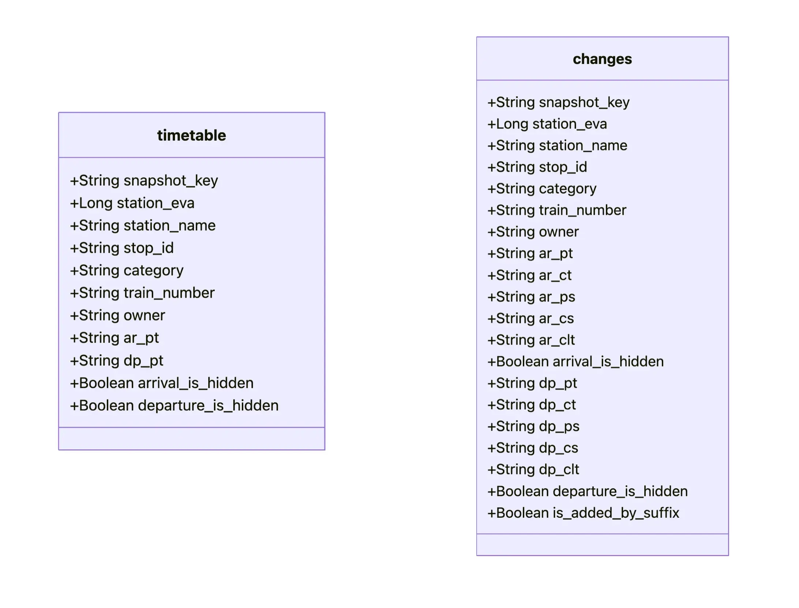
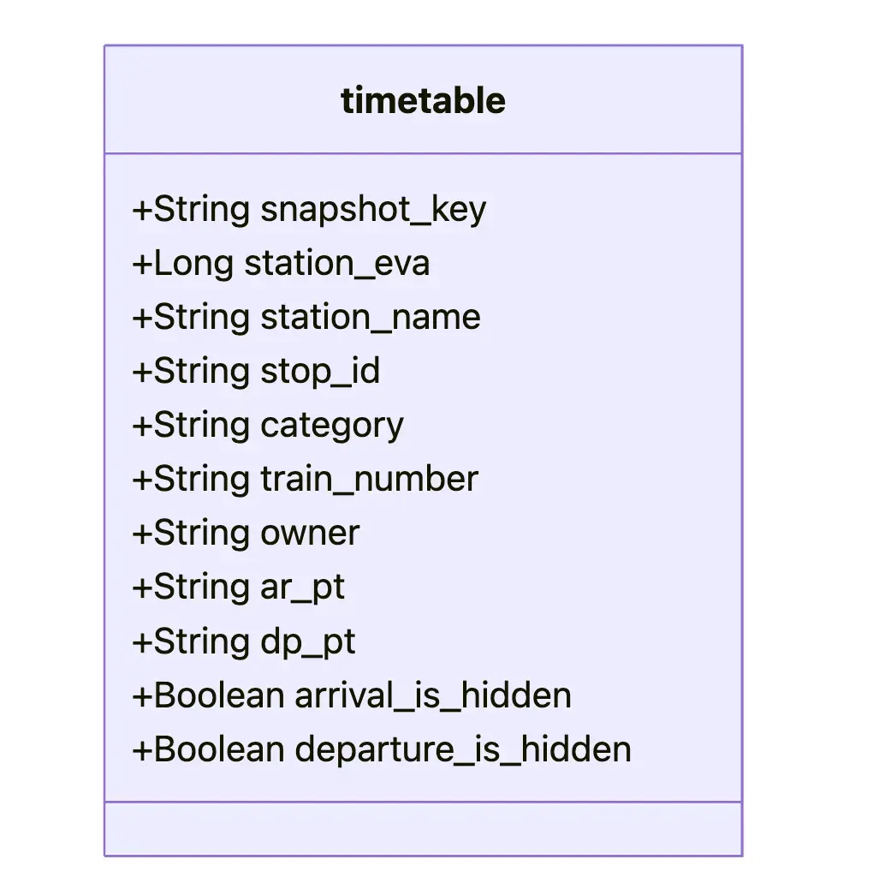

# Pipeline

## Initial Setup

Extract the content you unzip from the folders `/DBahn-berlin/timetable` and `/DBahn-berlin/timetable_changes` respectively into folders named `/timetable` and `/timetable_changes`. So the folder structure looks like the following:

```
.
├── DBahn-berlin
│   ├── ...
│   ├── timetable_changes
│   └── timetables
├── ...
├── timetable_changes
└── timetables
```

The folders `/timetable` and `/timetable_changes` will be gitignored.

## Star schema design (DW schema `dw`)

<!--  -->


Our warehouse follows a star-schema layout with one central fact table (`dw.fact_movement`) and three core dimensions (`dw.dim_station`, `dw.dim_train`, `dw.dim_time`). The fact table stores the observed state of train movements per snapshot, while dimensions provide descriptive context for analysis.

### Dimensions

- **`dw.dim_station` (station dimension)**  
   Stores one row per station, identified by the main EVA number (`station_eva`, primary key). It contains descriptive attributes (`station_name`) and geographical coordinates (`lon`, `lat`). The additional column `station_name_search` is a normalized representation used for fuzzy station name resolution during ingestion (pg_trgm).
- **`dw.dim_train` (train dimension)**  
   Stores one row per train identity. It uses a surrogate key (`train_id`) and enforces uniqueness on the natural identifier `(category, train_number)`. This enables grouping and filtering by train category (e.g., S/RE/ICE) and train number.
- **`dw.dim_time` (snapshot/time dimension)**  
   Stores one row per snapshot folder (`snapshot_key = YYMMDDHHmm`). Besides the key, it provides derived attributes (`snapshot_ts`, `snapshot_date`, `hour`, `minute`). This dimension represents _observation time_ ("state as-of snapshot"), not the planned/changed event timestamps.

### Fact table

- **`dw.fact_movement` (movement fact table)**  
   The fact table captures the planned schedule and its incremental updates. Each row represents the state of a single stop (`stop_id`) at a station (`station_eva`) for a given snapshot (`snapshot_key`) and train (`train_id`). Uniqueness is enforced by `(snapshot_key, station_eva, stop_id)`, allowing multiple "as-of" rows for the same stop over time (different snapshots).
  The fact table contains:
  - **Keys (foreign keys to dimensions):**
    - `snapshot_key -> dim_time`
    - `station_eva -> dim_station`
    - `train_id -> dim_train`
  - **Planned attributes (from `/timetables`):**
    - `planned_arrival_ts`, `planned_departure_ts`
    - `previous_station_eva`, `next_station_eva`
  - **Changed attributes (from `/timetable_changes`):**
    - `changed_arrival_ts`, `changed_departure_ts`
    - `changed_previous_station_eva`, `changed_next_station_eva`
  - **Measures used in analysis:** - cancellation flags (`arrival_cancelled`, `departure_cancelled`) - delays (`arrival_delay_min`, `departure_delay_min`) - visibility flags (`arrival_is_hidden`, `departure_is_hidden`)
    Station references for previous/next and changed previous/next are implemented as additional foreign keys back to `dim_station` (role-playing station relationships).

### Audit tables (supporting ingestion quality)

- **`dw.station_resolve_log`** records every station name resolution attempt (raw string, normalized string, best match, similarity score, and whether it was auto-linked).
- **`dw.needs_review`** stores unresolved or low-confidence station strings for manual inspection.

These tables are not part of the analytical star schema (and not included in the image above), but support data quality and debugging.

### Indices

- A trigram GIN index on `dim_station.station_name_search` accelerates fuzzy station lookup during ingestion.
- The composite index `(station_eva, stop_id, snapshot_key DESC)` on `fact_movement` accelerates "latest as-of snapshot" lookups, which are required to chain timetable changes on to the most recent available state.

---

# Documentation for the python pipeline

## Ingesting station data (`etl/stations.py`)

We parse `stations.json` and iterate over `result` (a list of station objects). For each station:

- We read the station name (`name`) and its `evaNumbers` array.
- We select the entry where `evaNumbers[].isMain == true` and extract:
  - `number` as the main EVA identifier
  - `geographicCoordinates.coordinates` as `(lon, lat)`
- We normalize the station name with `to_station_search_name()`
- We upsert one row into `dw.dim_station` with:
  - `station_eva` (primary key; main EVA number)
  - `station_name` (raw name from JSON)
  - `station_name_search` (normalized name)
  - `lon`, `lat` (coordinates)

The ingestion is idempotent: on conflict (`station_eva`) we update name/search/coordinates.

## Ingesting train data (`etl/trains.py`)

We iterate over all timetable XML files under `/timetables/**` and extract train identifiers from each `<tl>` element:

- `tl@c` $\rightarrow$ `category`
- `tl@n` $\rightarrow$ `train_number`
- We skip entries where `category` is `"Bus"` (case-insensitive).
- We de-duplicate `(category, train_number)` pairs in memory and insert them into `dw.dim_train`.

`train_id` is a database-generated surrogate key. We rely on a unique constraint on `(category, train_number)` (`ON CONFLICT DO NOTHING`) and then query `dw.dim_train` to build a mapping `(category, train_number) -> train_id` for fact-table ingestion.

## Ingesting time snapshots (`etl/time_dim.py`)

We derive time-dimension rows from the snapshot keys encoded in folder names:

- Timetables: `/timetables/{YYMMDDHH00}/...` (hourly snapshots)
- Timetable changes: `/timetable_changes/{YYMMDDHHmm}/...` (15-minute snapshots)

We discover all snapshot keys (10 digits `YYMMDDHHmm`), parse them into:

- `snapshot_key` (PK, string key from folder name)
- `snapshot_ts` (timestamp)
- `snapshot_date` (date)
- `hour`, `minute`
  We upsert into `dw.dim_time` on conflict (`snapshot_key`) to keep the pipeline idempotent.

## Ingesting planned movements (`etl/fact_planned.py`)

We ingest the "planned" schedule snapshots from `/timetables` and write them into `dw.fact_movement`. For each snapshot folder (`snapshot_key = YYMMDDHHmm`):

- We iterate over all station XML files in that snapshot and parse the root element.
- We resolve the station EVA (`station_eva`) for the file using:
  1. `root@eva` if present, else
  2. `root@station` (resolved by name), else
  3. a filename-derived station name.  
     Name-based resolving uses `pg_trgm` similarity against `dw.dim_station.station_name_search`. Every attempt is logged into `dw.station_resolve_log`, and uncertain matches are written into `dw.needs_review`.

For each `<s>` stop element in the station file:

- We read `s@id` as `stop_id` (the stop identifier in the dataset).
- We read the train descriptor from `<tl>`:
  - `tl@c` $\rightarrow$ `category`
  - `tl@n` $\rightarrow$ `train_number`  
     We skip entries where `category == "Bus"`. We map `(category, train_number)` to `train_id` via `dw.dim_train` (creating the train row if missing).
- We read arrival and departure nodes (if present): `<ar>` and `<dp>`.
  - We mark an event as hidden if `hi="1"`.
  - We skip the stop only if both arrival and departure are hidden.  
     Otherwise we keep the stop and store:
    - `planned_arrival_ts` from `ar@pt` only if arrival is not hidden
    - `planned_departure_ts` from `dp@pt` only if departure is not hidden
    - `arrival_is_hidden`, `departure_is_hidden` flags in the fact row
- We infer previous/next stations from the path fields:
  - For the arrival event (if present and not hidden), we use `ar@cpth` else `ar@ppth` and take the last station name in the pipe-separated list as the previous station.
  - For the departure event (if present and not hidden), we use `dp@cpth` else `dp@ppth` and take the first station name in the pipe-separated list as the next station.
    These raw names are resolved to EVA numbers using the same station resolver. If the resolver returns the current `station_eva` as previous/next, we set that value to `NULL` to avoid "previous/next=current" artifacts.

We then upsert one row per `(snapshot_key, station_eva, stop_id)` into `dw.fact_movement`, filling only the planned-related fields:

- `train_id`, `planned_arrival_ts`, `planned_departure_ts`
- `previous_station_eva`, `next_station_eva`
- `arrival_is_hidden`, `departure_is_hidden`

All change-related fields (`changed_*`, cancellation flags, delays) remain at their defaults (`NULL` / `false`) in planned ingestion.

The ingestion is idempotent: on conflict (`snapshot_key, station_eva, stop_id`) we update the planned fields for that snapshot row, so repeated runs do not create duplicates.

## Ingesting timetable updates (`etl/fact_changed.py`)

After the planned baseline is loaded from `/timetables`, we ingest incremental updates from `/timetable_changes`. Each changes snapshot represents the current state at time `snapshot_key = YYMMDDHHmm`. The goal is to create a new fact row for that snapshot by copying the latest known planned context for the same stop and then applying any updates (delay, cancellation, path change).

### Reading a changes snapshot and resolving station/train IDs

For each station XML file in the snapshot:

- We resolve the station EVA (`station_eva`) using the same strategy as planned ingestion:
  1. `root@eva`, else
  2. `root@station` (name-based resolve), else
  3. filename-derived station name.  
     Name resolves are done via `pg_trgm` similarity on `dw.dim_station.station_name_search`, with all attempts logged to `dw.station_resolve_log` and uncertain matches added to `dw.needs_review`.

For each `<s>` stop element:

- We read `s@id` as `stop_id`.
- We read `<tl c="..." n="...">` to obtain `(category, train_number)` and map it to `train_id` (creating the train if missing). We skip `"Bus"`.

### Extracting update signals from `<ar>` and `<dp>`

For the arrival `<ar>` and departure `<dp>` nodes we parse:

- Changed times
  - `ar@ct` $\rightarrow$ `changed_arrival_ts`
  - `dp@ct` $\rightarrow$ `changed_departure_ts`
- Cancellation state (authoritative signal: `cs`)  
   We interpret `cs` as the current cancellation status for that event:
  - `cs = 'c'` $\rightarrow$ cancelled now
  - `cs = 'p'` or `cs = 'a'` $\rightarrow$ explicitly not cancelled now (e.g. revocation / planned / added)
  - `cs` missing $\rightarrow$ no update; we will carry forward the previous cancellation state from the base row  
     We do not treat `clt` as the cancellation state because it can appear in inconsistent combinations (e.g. together with `cs='p'`).
    **Revoked cancellations:** A previously cancelled event can be revoked by a later update with `cs='p'` (or `cs='a'`). We reset `arrival_cancelled` / `departure_cancelled` back to `false` whenever `cs` indicates a non-cancelled state. If `cs` is missing, we keep (carry forward) the base cancellation flags.
- Added stops  
   A stop can exist only in `timetable_changes` (i.e., there is no planned row). We detect such "added" stops if any of:
  - `ps = 'a'` on `<ar>` or `<dp>`, or
  - `cs = 'a'` on `<ar>` or `<dp>`, or
  - the integer suffix of `stop_id` (after the last `-`) is `>= 100`
- Hidden flags  
   We read `hi="1"` into `arrival_is_hidden` / `departure_is_hidden` (stored on the as-of row). Unlike planned ingestion, we do not drop the stop unless we decide the stop has no meaningful update signals.
- Changed path (prev/next)  
   If a path is present, we prefer `cpth` else `ppth`:
  - previous station comes from the last station in the arrival path list
  - next station comes from the first station in the departure path list  
     These station names are resolved (pg_trgm) and stored as `changed_previous_station_eva` / `changed_next_station_eva` (self-resolves to the current station are nulled).

We keep a stop only if it contains at least one meaningful signal (a changed/planned time, a cancellation signal, a path update, or is detected as an added stop).

### Chaining logic: choose the latest base row for each stop key

A stop is identified across time by `(station_eva, stop_id)`. Because changes arrive in multiple snapshots, we must apply each new snapshot on top of the latest available row (planned or already changed).

For each `(station_eva, stop_id)` observed in the current changes snapshot `S`, we fetch the base row as:

- base row = the row in `dw.fact_movement` with the same `(station_eva, stop_id)` and the maximum `snapshot_key` such that `snapshot_key <= S`

Later changes snapshots build on the latest known state, not necessarily the original planned snapshot.

### Writing the "as-of" row for snapshot S

For each stop key `(station_eva, stop_id)` we insert a new row at snapshot `S`:

- Copy planned fields from the base row
  - `train_id`
  - `planned_arrival_ts`, `planned_departure_ts`
  - `previous_station_eva`, `next_station_eva`
  - `arrival_is_hidden`, `departure_is_hidden` (unless overridden by flags in the change file)
- Apply updates from the change snapshot
  - `changed_arrival_ts`, `changed_departure_ts` from `ct`
  - `arrival_cancelled`, `departure_cancelled`:
    - if `cs` is present for that event, use it
    - otherwise carry forward the base row's cancellation state
  - `arrival_delay_min`, `departure_delay_min`:
    - computed only when the event is not cancelled, the planned timestamp exists, and the changed timestamp exists
    - delay = `(changed_ts - planned_ts)` in minutes
  - optional path update:
    - `changed_previous_station_eva`, `changed_next_station_eva` from `cpth`/`ppth`

### Handling added stops with no planned base row

If no base row exists for `(station_eva, stop_id)` with `snapshot_key <= S`, we only insert the row if it is detected as an added stop. In that case:

- We build the planned timestamps from `pt` if available, otherwise leave them `NULL` (and use `ct` as the changed timestamps if present).
- We require a valid `train_id` from `<tl>` because `fact_movement.train_id` is `NOT NULL`.
- Cancellation defaults to "not cancelled" unless a `cs='c'` explicitly indicates cancellation.
- Prev/next station references are derived from the path fields (prefer `cpth`, else `ppth`) and stored both as base prev/next (best available topology) and optionally as changed prev/next.

### Idempotency

Each as-of row is unique by `(snapshot_key, station_eva, stop_id)`. We upsert on this key:

- If the row already exists for snapshot `S`, we overwrite the changed fields (and keep the planned context for that snapshot row consistent).
- This makes re-running the changes step safe and repeatable.

This design allows querying a stop's evolution by selecting all rows for the same `(station_eva, stop_id)` ordered by `snapshot_key`, where each row represents the state "as of" that snapshot.

## Appendix: Station name resolution (pg_trgm–based fuzzy matching)

Our raw timetable files reference stations in multiple inconsistent ways (root EVA number, station name strings, or filename-derived names). To map any station mention to the canonical station dimension (`dw.dim_station`), we use a fuzzy-matching resolver based on PostgreSQL trigram similarity (`pg_trgm`).

### Inputs and output

Input to the resolver:

- `station_raw`: the station string to resolve (e.g., `"Berlin-Charlottenburg"`, `"alexanderplatz"`, `"s_dkreuz"` from filenames, etc.)
- `snapshot_key`, `source_path`: metadata for auditing/logging
- `threshold`: similarity cutoff for "auto-linking"

Output:

- `station_eva` (`BIGINT`) if confidently matched, otherwise `NULL`.

### Normalization (`to_station_search_name()`)

Before matching, we normalize station strings into a searchable form. The goal is to reduce spelling/formatting noise so that fuzzy matching is robust.

Normalization steps (in order):

- lowercasing + trimming
- German character folding:
  - `ß -> s`, `ä -> a`, `ö -> o`, `ü -> u`
- special handling for underscores inside words (used as umlaut placeholders in filenames):
  - `s_d → sd` (underscore removed only when between word characters)
- expand/normalize common abbreviations:
  - `hbf -> hauptbahnhof`
  - `bf -> bahnhof` (excluding "hbf")
  - `str -> strase` and joining patterns like `"osdorfer strase" -> "osdorferstrase"`
- drop the token `"berlin"` (so `"Berlin Gesundbrunnen"` matches `"Gesundbrunnen"`)
- replace all remaining non-alphanumeric characters with spaces
- collapse multiple spaces

The resulting string is stored in:

- `dw.dim_station.station_name_search` (for canonical stations from `stations.json`)
- `station_search_full` (for each resolution attempt)

### Core-token filtering (avoid matching on generic words)

Some tokens occur in many station names and are not helpful for matching (e.g., `"bahnhof"`, `"hauptbahnhof"`, `"station"`, `"sbahn"`, `"ubahn"`). We define a small set of generic tokens and build a "core token list":

- Split `station_search_full` into tokens
- Keep only tokens with length $\geq$ 2
- Drop tokens in the `GENERIC` set

If we have at least one core token, we build:

- `score_query = " ".join(core_tokens)` (or fall back to full normalized string if core tokens are empty)
- `core_pat` = a word-boundary regex matching any core token, e.g. `\m(token1|token2)\M`

This reduces false positives where the similarity score is high only because of generic words.

### Fuzzy matching query (pg_trgm)

We select the single best candidate station from `dw.dim_station` using pg_trgm:

- If `core_pat` exists, we restrict candidates to those containing at least one core token.
- If core tokens are empty (rare), we scan without the regex restriction.

### Auto-link decision (threshold + fallback rule)

After retrieving the best candidate `(best_station_eva, best_score)`:

- If we have core tokens:
  - auto-link if `best_score >= threshold` (e.g., `0.52` in our runs)
- If we do not have core tokens:
  - auto-link only if `best_score >= 0.72` (stricter fallback to avoid generic matches)

If auto-linking fails, the resolver returns `NULL`.

### Auditing and manual review support

Every resolution attempt is recorded in `dw.station_resolve_log`:

- `snapshot_key`, `source_path`
- `station_raw`, `station_search` (normalized)
- best candidate EVA/name, best score
- `auto_linked` boolean

If auto-linking fails or is borderline, we also upsert into `dw.needs_review` keyed by `station_search`, storing:

- best candidate and score
- last snapshot where it was seen
- last source file

This lets us inspect unresolved or ambiguous station names and improve normalization or station data if needed.

### Where station strings come from in the pipeline

The resolver is used in three places:

1. Station file identity (`station_eva`)
   - Prefer `root@eva`
   - Else resolve `root@station`
   - Else resolve filename-derived station string

2. Path-based neighboring stations (prev/next)
   - From `ppth`/`cpth` lists in `<ar>` / `<dp>`:
     - previous station from arrival path (last element)
     - next station from departure path (first element)

3. Changes path updates
   - Same path logic, stored in `changed_previous_station_eva` / `changed_next_station_eva`

In all cases, the same normalization + pg_trgm matching + auditing logic is applied, so station identity is consistent across planned and changes ingestion.

## Task 2: SQL Queries

### 2.1

```sql
SELECT station_eva, station_name, lon, lat
FROM dw.dim_station
WHERE station_name = '...';
```

We store coordinate information in the table `dim_station` as `lon` and `lat`, which makes it straightforward to return these. `station_eva` is returned as well which is the primary key to the table `dim_station`.

### 2.2

```sql
PREPARE get_closest_station(double precision, double precision) AS
SELECT station_eva, station_name, lon, lat
FROM dw.dim_station
ORDER BY (
  power(lat - $1, 2) +
  power((lon - $2) * cos(radians($1)), 2)
)
LIMIT 1;
```

We select the same fields as the previous task and we order them by measuring the euclidian distance of the _equirectangular approximation_ of the coordinates. We return the top row with `LIMIT 1`.

### 2.3

```sql
WITH params AS (
  SELECT '...'::text AS s  -- snapshot S
),
latest AS (
  SELECT DISTINCT ON (fm.station_eva, fm.stop_id)
    fm.station_eva,
    fm.stop_id,
    fm.train_id,
    fm.arrival_cancelled,
    fm.departure_cancelled
  FROM dw.fact_movement fm
  JOIN params p ON true
  WHERE fm.snapshot_key <= p.s
  ORDER BY fm.station_eva, fm.stop_id, fm.snapshot_key DESC, fm.movement_key DESC
),
canceled_station_train AS (
  SELECT DISTINCT
    station_eva,
    train_id
  FROM latest
  WHERE arrival_cancelled OR departure_cancelled
)
SELECT
  COUNT(*) AS cancellations_per_station_total
FROM canceled_station_train;

```

To count cancellations at a given snapshot cutoff `S`, we treat `dw.fact_movement` as an "as-of" fact table and first restrict rows to `snapshot_key <= S`. Because each stop `(station_eva, stop_id)` can appear in multiple snapshots (planned baseline plus later updates), we select the most recent row per movement using `DISTINCT ON ... ORDER BY snapshot_key DESC`. We then keep only rows where either `arrival_cancelled` or `departure_cancelled` is true. To follow the requirement "count a train cancelled once per station", we deduplicate by `(station_eva, train_id)` and finally count these distinct station-train pairs. This yields the number of trains that are cancelled at each station according to the latest available state up to snapshot `S`.

### 2.4

```sql
WITH st AS (
  SELECT station_eva, station_name
  FROM dw.dim_station
  WHERE station_name = '...'  -- input station name
),

latest AS (
  SELECT DISTINCT ON (fm.station_eva, fm.stop_id)
    fm.station_eva,
    fm.stop_id,
    fm.arrival_delay_min,
    fm.departure_delay_min,
    fm.arrival_cancelled,
    fm.departure_cancelled,
    fm.arrival_is_hidden,
    fm.departure_is_hidden
  FROM dw.fact_movement fm
  JOIN st ON st.station_eva = fm.station_eva
  ORDER BY fm.station_eva, fm.stop_id, fm.snapshot_key DESC, fm.movement_key DESC
),

delay_obs AS (
  SELECT arrival_delay_min AS delay_min
  FROM latest
  WHERE arrival_delay_min IS NOT NULL
    AND arrival_delay_min >= 0
    AND arrival_cancelled = FALSE
    AND arrival_is_hidden = FALSE

  UNION ALL

  SELECT departure_delay_min AS delay_min
  FROM latest
  WHERE departure_delay_min IS NOT NULL
    AND departure_delay_min >= 0
    AND departure_cancelled = FALSE
    AND departure_is_hidden = FALSE
)
SELECT
  st.station_name,
  st.station_eva,
  AVG(delay_min)::double precision AS avg_delay_min,
  COUNT(*) AS n_delay_observations
FROM delay_obs
JOIN st ON true
GROUP BY st.station_name, st.station_eva;
```

To compute the average delay for a station, we first resolve the station name to its `station_eva` in `dw.dim_station`. Since `dw.fact_movement` stores multiple "as-of" rows over time for the same stop, we collapse the timeline by selecting the most recent row per movement key `(station_eva, stop_id)` using `DISTINCT ON ... ORDER BY snapshot_key DESC`. From these latest rows, we extract delay observations from both arrival and departure (`arrival_delay_min`, `departure_delay_min`) and union them into a single stream of numbers. We exclude invalid observations by filtering out `NULL` delays, negative delays, cancelled events, and hidden events. Finally, we compute `AVG(delay_min)` and report the number of included observations as a sanity check.

# Task 3.1 Spark Architecture & ETL Flow

Utilizing Apache Spark, the pipeline ingests raw XML, resolves data quality issues (missing identifiers), merges planned schedules with live updates, and produces a Parquet dataset for delay analysis and traffic density queries.

**Running the Pipeline:**

After adjusting the resources specified in `docker-compose.yml` for the local machine:
ETL:

```
spark-submit \
  --master spark://spark-master:7077 \
  spark_batched.py
```

Queries for Task 3.2 and 3.3

```
spark-submit \
  --master spark://spark-master:7077 \
  spark_queries.py
```

The logic follows the same approach we implemented for the Task 1.2. Rewritten using built in Spark functions.

## Extraction

For the extraction of the xml files we use `sparkContext.wholeTextFiles`, to handle possible xml irregularities.

- **Batch Parsing:** The custom parsers (`parse_timetable_partition`, `parse_changes_partition`) run inside `mapPartitions`. This allows multiple XML files to be parsed in a single task execution, significantly reducing overhead compared to parsing files individually.
- **Attribute Extraction:** Logic uses Python's `xml.etree` to extract specific attributes and flatten the hierarchical XML into flat rows.

## Transformation (Data Cleaning & Resolution)

**A. Station Identity Resolution (Backfilling):**
It implements a simplified version of station name matching used in Task 1.2
Since timetable lacks the `station_eva` that we use as the primary key. This function implements a two-stage name matching against a look up table from the reference (`station_data.json`) to recover the station_eva:

1. **Normalizied Exact Match:** Station names are normalized (e.g., "Berlin-Tegel (S)" $\rightarrow$ "tegel s") to ensure consistent matching, using the same Python UDF `to_station_search_name()` for Task 1.2. Then direct join against the normalized lookup table.
2. **Fuzzy Match:** For remaining unmatched records, a combined match score is applied (taking the max score after threshold filtering):
   - **Levenshtein Distance:** Measures character edits required to match strings. With threshold of (0.5 >= levenshtein distance normalized for string length)
   - **Jaccard Similarity:** Measures token overlap to prevent false positives (e.g., distinct stations with similar spellings that differ in letters like Schöneweide-Schöneberg, Schulzendorf-Zehlendorf), with 0.3 threshold, which might be a small value for noisier datasets.

> Since the station lookup table is small, it is broadcasted to all nodes to perform this computationally expensive join efficiently without data shuffling.

**B. State Resolution (Merging Planned vs. Actual):**

Implemented in `resolve_latest_stop_state()`. A train stop may have one planned record and multiple update records over time.

- **Union:** The planned and changes DataFrames are unified into a single stream of events.
- **Windowing:** A Spark Window partitioned by `stop_id` and `station_eva` orders events by `snapshot_key` (time).
- **Coalescence:** The pipeline uses `last(ignorenulls=True)` to carry forward the most recent valid status update for every field (arrival time, cancellation status, platform).
- **Filtering:** "Changes-only" stops (updates with no corresponding planned schedule) are discarded unless explicitly marked as "added" stops.

## Load (Storage)

As per the task description pipeline writes the processed data (but also the input data namely `timetables`and `changes` to be able to manually verify the `final_movements` contents, it can/should be commented out for a deployed pipeline) in **Parquet** format.
Written Parquets are partitioned by `snapshot_date`.
Unlike `fact_movement`finalized table `movements/final_movements` that is to be used for queries contain only the resolved arrival/departure times, and not the every change made for the stop.

Possible enhancement would be to write the partitions like the dataset folder structure where we would have a intermediary folder for each week and inside the parquets with each day of that week. Since we already have larger tables (15 mins of each station vs 1 day of every station) we have decided to keep this simplified folder structure for the storage.

---

## Data Schema

### Input Schemas

The name of the fields kept in shortened form for consistency with the xml contents.



### Output Schema (`final_movements`)



---

# Task 3.2 & 3.3

The pipeline includes built-in analytical modules (Tasks 3.2 & 3.3) that operate on the resolved data.

**1. Average Daily Delay Calculation:**

Since the exercise sheet did not specify the input format, we are assuming the input is station_eva.

- **Logic:** `delay = actual_time - planned_time`.
- The query differentiates between On Time (no change record) and Delayed. It calculates delay only when a changed time exists.
- **Exclusions:** Cancelled stops and "hidden" operational stops are excluded from the average.

We load the Parquet dataset from Task 3.1 into a Spark DataFrame and restrict the data to a given station and observation period. Arrival and departure delays are computed independently in minutes as the difference between actual and planned timestamps. Invalid observations are then excluded by filtering out `NULL` delays, negative delays, cancelled events, and hidden events. Arrival and departure delay observations are combined into a single dataset and grouped by day to compute the average delay per day.

Finally, the overall average daily delay for the station is computed as the mean of daily average delays.

The corresponding Spark implementation is provided in the function `compute_avg_daily_delay` in `..\spark_etl\spark_queries.py`.

**2. Peak-Hour Traffic Density:**

- **Logic:** Aggregates departures occurring during peak windows (07:00–09:00 and 17:00–19:00).
- **Aggregation:** Computes the average count per station per day. Importantly, it includes days with zero departures.

We load the Parquet dataset from Task 3.1 into a Spark DataFrame. To compute the average number of train departures per station during peak hours, we first pre-process the data by filtering out cancelled or hidden departure events and records missing a planned departure time.

The `actual_departure_ts` is derived by prioritizing the changed timestamp (where available) over the planned one. From this value, we extract the hour and the date. The dataset is then filtered for peak hours (07:00–09:00 and 17:00–19:00).

For each station and day, we count the number of such departures. Since some stations may have no activity on certain days within those time ranges, we left-join the counts to the complete set of all station–day pairs, filling missing counts with 0. Finally, the data are aggregated to compute the average daily number of peak-hour departures per station.

The corresponding Spark implementation is provided in the function `compute_peak_hour_departure_counts` in `..\spark_etl\spark_queries.py`.

# Task 4: Graph

## 4.1

The file `/graph/graph_setup.py` builds an undirected NetworkX graph from Postgres:
- Nodes: all stations from `dw.dim_station` (EVA as node id, name + lat/lon as attributes).
- Edges: planned topology from `dw.fact_movement` using only baseline snapshots (`dw.dim_time.minute = 0`), connecting `previous_station_eva <-> station_eva` and `station_eva <-> next_station_eva` (skipping hidden arrival/departure sides).  

For each edge we attach small metadata (sample train category/number, a sample snapshot/stop_id, and how often the edge appears across trains/snapshots).

Exports an interactive Folium HTML map showing nodes and edges and supports shortest path (fewest hops) between two station names via `nx.shortest_path`.

## 4.2

The file `/graph/earliest_arrival.py` computes earliest arrival time given:
- source station name, target station name, and a departure time key `YYMMDDHHmm`.

It loads the latest known state as-of that snapshot from `dw.fact_movement`, builds timed ride legs by grouping stops per `(train_id, service_date)`, and then runs the _Connection Scan Algorithm (CSA)_ to find the earliest reachable arrival. It prints the resulting route as a list of ride legs with departure/arrival times.
